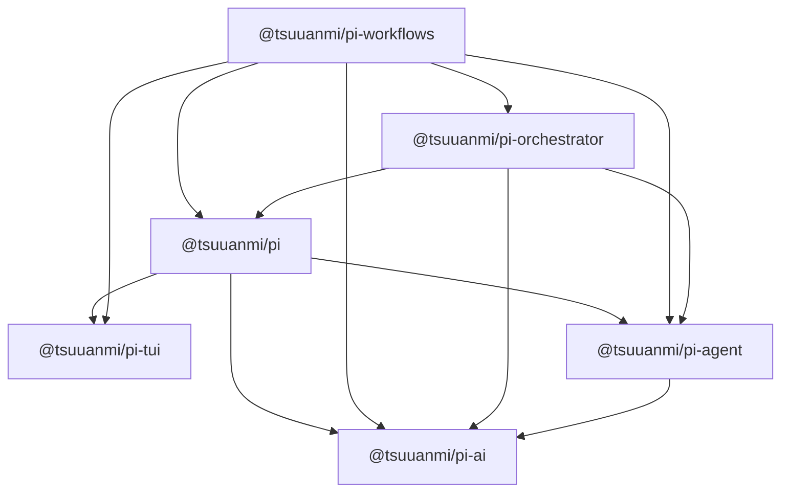

# Package Boundaries

This document defines ownership and import direction for all seven Pi workspace packages. See [Package Overview](package-overview.md) for the big-picture runtime map and the package detail pages for component-level descriptions.

Related decisions:

- [Component Integration Map](component-integration-map.md)
- [Package Overlap Audit](package-overlap-audit.md)
- [Orchestrator vs. Workflows](orchestrator-vs-workflows.md)
- [Workflow Orchestrator Overlap](workflow-orchestrator-overlap.md)
- [Receipt Boundaries](receipt-boundaries.md)
- [Event Boundaries](event-boundaries.md)
- [Persistence Boundaries](persistence-boundaries.md)

## Core rule

A package may expose contracts and callbacks through its public boundary. The Pi host may load workflow packages through manifests, while workflow packages may consume Pi's public host/session contracts. Pi source must not statically import workflow implementation code.

For dependency diagrams and tables in this document, an arrow points from consumer to dependency.

## Current runtime dependency graph



The source-import graph and package dependency graph agree for static imports. The manifest runtime graph additionally loads packages that declare `pi` resources:

| Consumer | Direct workspace dependencies | Why |
|---|---|---|
| `@tsuuanmi/pi-ai` | None | Lowest model/provider protocol |
| `@tsuuanmi/pi-agent` | ai | Runs AI streams and validates model tool arguments |
| `@tsuuanmi/pi-orchestrator` | ai, agent, pi | Schedules Agents and owns session-aware subagent execution |
| `@tsuuanmi/pi-tui` | None | Independent terminal toolkit |
| `@tsuuanmi/pi-workflows` | ai, agent, orchestrator, tui, pi | Adapts model/agent/orchestration contracts, extends Pi session paths, and produces HUD data |
| `@tsuuanmi/pi` | ai, agent, tui | Core application/session host and bundled package host |

There are no workspace peer dependencies and no runtime cycles. Orchestrator imports Pi only through published APIs; Pi does not import orchestrator.

## Package ownership

| Package | Owns | Must not own |
|---|---|---|
| [`@tsuuanmi/pi-ai`](packages/ai.md) | Model/message/tool/usage protocol, provider registry and adapters, model metadata, OAuth primitives, normalized streams | Agent loop, tool execution, credentials, sessions, workflows, CLI/UI |
| [`@tsuuanmi/pi-agent`](packages/agent.md) | Single-agent state and turn loop, generic tools, hooks/events/traces, tool receipts, canonical Agent model/thinking types, Node process primitives in `/node` | Provider implementations, Pi sessions/tools/UI, subagent management, task DAG scheduling, workflow policy, `.pi` ownership |
| [`@tsuuanmi/pi-orchestrator`](packages/orchestrator.md) | Generic task DAGs, Teams, routing, scheduling, retries, verification, checkpoint contracts, and complete Pi-hosted subagent execution | Workflow phases/artifacts, the main Pi session/UI, provider transport, durable workflow checkpoint location |
| [`@tsuuanmi/pi-tui`](packages/tui.md) | Terminal I/O, component contracts, focus/overlays, differential rendering, editing/input, themes, ANSI/Unicode utilities | Models, agents, application commands, extension lifecycle, persistent settings/session/workflow state |
| [`@tsuuanmi/pi-workflows`](packages/workflows.md) | Named workflow policy, transitions/gates/handoffs, tools/commands, workflow state/artifacts/audit, and orchestrator composition | Generic agent loop, provider transport, generic task engine internals, concrete subagent implementation, Pi startup/session/UI composition |
| [`@tsuuanmi/pi`](packages/pi.md) | CLI/SDK, startup, main sessions, settings/auth, `.pi` roots, resources/packages, extensions, built-in tools, and mode/UI composition | Provider, agent, orchestrator, TUI, workflow policy, or subagent implementation internals |

## Execution boundaries

| Operation | Owner | Integration rule |
|---|---|---|
| Normalize and stream one provider request | AI | Caller supplies model/context/options and consumes normalized events |
| Run one agent and execute its requested tools | Agent | Host supplies models, stream/auth callbacks, tools, and hooks |
| Spawn/control one Pi-hosted subagent session | Orchestrator | Agent owns the loop; Pi exposes generic session services; Orchestrator owns records, isolated sessions, lifecycle, persistence, native execution, and durable inspection |
| Schedule, route, retry, or verify multiple agent tasks | Orchestrator | Higher layer supplies Agents, task inputs, hooks, and checkpoint storage |
| Enforce named workflow roles, phases, gates, and artifacts | Workflows | Workflow tools consume Orchestrator's public `SubagentManagerApi` or generic orchestration primitives |
| Render terminal state | TUI | Host supplies component data and callbacks; TUI owns rendering and input mechanics |
| Compose the application | Pi | Pi imports public lower-layer APIs; workflow packages may import only Pi's public host/session contracts |

### Single-subagent versus multi-agent work

A direct Orchestrator `SubagentManagerApi` call is valid for lifecycle control or one workflow-owned worker. Generic dependencies, queues, routing, retries, verification, and multi-agent collaboration must use Orchestrator.

The boundary checker allows direct manager operations in these workflow adapters:

- `packages/workflows/src/tool/context.ts` for the structural orchestrator subagent capability exposed to workflow tools.
- `packages/workflows/src/skills/team/agent-adapter.ts` for the Agent bridge.
- `packages/workflows/src/skills/ralplan/agent-adapter.ts` for Orchestrator-backed role execution.
- `packages/workflows/src/skills/ultragoal/tools.ts` for one guarded goal worker.

Team multi-agent execution must route through `runTeamOrchestrator`. Unknown manager call sites fail the check instead of falling back to another execution path.

Orchestrator controls under `packages/orchestrator/src/subagent/` use the concrete manager for inspect, attach, and kill operations. They must not import Pi private modules or workflow contracts.

## Public API boundary

- Import another package only through a path published by that package's `exports` map. TUI is the exception in form, not intent: it publishes only its root `main`/`types` entry and has no supported subpath API.
- `#ai/*`, `#agent/*`, `#orchestrator/*`, `#tui/*`, `#workflows/*`, and `#pi/*` are private aliases for code inside the same package.
- Do not import another package's `src/`, private `dist/` files, test helpers, or internal alias.
- A direct source import requires a direct `dependencies` or `peerDependencies` declaration. A development dependency or transitive dependency is insufficient for runtime source.
- Adapters belong to the higher layer. Examples: Workflows owns its Orchestrator adapters; Pi owns its extension-to-Agent bridge. Provider adapters remain in AI. An adapter translates and delegates; it must not reproduce the lower package's state machine or guarantees.
- A package that declares `pi` resources must own its compiled files and manifest-relative paths. Pi discovers and copies declared package artifacts without package-specific rewrites.
- Package root barrels are compatibility surfaces. New exports should be intentional and documented; wildcard exports reduce the freedom to reorganize internals.

## Hard semantic rules

- Each concept has one owner. Do not add fallback ownership, a second engine, or a compatibility facade in another package.
- Lower layers do not import higher layers.
- Workflows may import published Pi session APIs and orchestrator subagent APIs, but must not import private aliases or source paths.
- Orchestrator may import published Pi host APIs but must not import Pi private aliases or workflow state, gates, receipts, artifacts, or UI.
- Agent must not import Orchestrator, Workflows, Pi, or TUI.
- AI and TUI remain independent workspace leaves unless an explicit architecture change is approved.
- Bundled workflow adapters may use Orchestrator, but Pi must not duplicate workflow policy or orchestration paths. Pi loads workflow adapters through package manifests.
- Generic process spawning, waiting, termination, and Bash resolution belong in `@tsuuanmi/pi-agent/node`; Pi owns application-specific Bash backends, output policy, and process registration.
- Agent owns tool validation and execution semantics. Pi may select, authorize, and transport tool calls, but must not invoke a parallel Tool execution path.
- Names must identify the owning layer where concepts overlap, such as workflow Team state versus Orchestrator `Team`.

## Mechanical enforcement

Run:

```bash
npm run check:package-boundaries
```

For the six configured packages, `scripts/check-package-boundaries.mjs`:

1. Scans production TypeScript imports under each package `src/` tree.
2. Validates imports against the configured allowed dependency graph.
3. Rejects cycles in that configured graph.
4. Requires a direct runtime or peer dependency declaration for each cross-package source import.
5. Requires build aliases to resolve beneath the dependency's `dist/` output.
6. Rejects imports of package subpaths that are not published.
7. Applies Pi-internal layering rules.
8. Restricts direct workflow `SubagentManagerApi` operations and Team execution paths.
9. Rejects Orchestrator imports from Ultragoal while the skill has no generic dependency DAG.

The checker's configured maximum graph is broader than the current runtime graph:

| Package | Checker permits imports from |
|---|---|
| AI | None |
| Agent | AI |
| Orchestrator | Agent, AI |
| TUI | None |
| Workflows | Agent, Orchestrator, AI, TUI |
| Pi | Agent, Orchestrator, AI, TUI, Workflows |

The currently unused permitted edges are Orchestrator to AI and Pi to Orchestrator. Adding either would still require a direct manifest dependency and build alias. Treat either as an architecture change, not as pre-approved coupling.

### Pi-internal rules

The same checker also enforces selected boundaries inside `packages/pi`:

- `src/api/` cannot import runtime or UI implementation modules.
- `src/package/` cannot import CLI, modes, or UI.
- Orchestrator `src/subagent/` cannot import Pi private aliases or workflow implementation surfaces.
- Package loading cannot reach back through the broad `#pi/index` barrel.

These rules keep public SDK/configuration code from depending on application-mode internals and prevent circular composition through broad barrels.

### Non-workspace alias drift

The root `tsconfig.json` still contains `@tsuuanmi/pi-agent-old` aliases that point to a nonexistent `packages/agent-old/` directory. They are stale editor/typecheck configuration, not an eighth package and not an edge in the workspace graph. Remove them in a separate configuration cleanup.

## Receipt ownership

| Receipt | Owner | Purpose | Boundary rule |
|---|---|---|---|
| Tool receipt | Agent | Evidence for one tool execution inside one agent run | Must not own task routing or workflow state |
| Task receipt | Orchestrator | Evidence for one routed/retried/verified orchestrated task | Must not own workflow state or artifact layout |
| Workflow runtime receipt | Workflows | `WorkflowRuntimeReceipt` evidence for workflow actions and state transitions | May reference lower-layer receipt ids without owning their schemas |

Pi persists or transports receipts for its sessions, but persistence by the host does not transfer schema ownership.

## Persistence ownership

| State | Owner | Contract |
|---|---|---|
| AI registry/session resources | AI | Process-local registries and explicit resource cleanup; no application persistence |
| Agent state | Agent | In-memory message/tool/run state for one Agent |
| Orchestrator checkpoint | Orchestrator | Strict versioned value behind caller-provided `OrchestratorCheckpointStore` |
| TUI state | TUI | Process-local render/input/theme mechanics; active application keybindings and repository snapshots are injected by Pi; no application persistence |
| Workflow state | Workflows | Explicit-session workflow state, artifacts, audit, receipts, runtime ownership, and recovery |
| Pi application state | Pi | Settings, auth, main sessions, extension state, and mode/runtime state |
| Subagent state | Orchestrator | Records, artifacts, identities, and worker metadata under the Pi session state root |

Workflows may implement an Orchestrator checkpoint store. Orchestrator must not import workflow storage. Pi must not interpret Orchestrator checkpoint internals except through package APIs.

## Overlap map

| Overlap area | Risk | Ownership split |
|---|---|---|
| Messages/tools | AI protocol can be confused with Agent execution | AI owns provider wire-neutral values; Agent owns execution and agent-only roles |
| Teams/tasks | Generic Orchestrator concepts can be confused with workflow skill state | Orchestrator owns generic DAG/team mechanics; Workflows owns named workflow behavior |
| Routing | Agent selection can overlap expected-next workflow roles | Orchestrator owns generic eligibility/scoring; Workflows owns phase/role policy |
| Checkpoints | Orchestrator run checkpoints can be confused with workflow state | Orchestrator owns checkpoint schema; Workflows owns storage and workflow recovery |
| Receipts | Tool, task, and workflow evidence can overlap | Agent, Orchestrator, and Workflows each own their layer's schema |
| UI/HUD | Workflow status can be confused with rendering | Workflows owns HUD data; Pi composes it; TUI renders it |
| Artifacts | Task output can be confused with user-facing workflow artifacts | Orchestrator returns task results; Workflows owns artifact layout and display semantics |
| Governance | Generic dispatch/consequential gates can overlap workflow gates | Orchestrator owns generic execution gates; Workflows owns named workflow policy |

## Rule of thumb

- Provider request, response, model, OAuth primitive, or normalized stream: AI.
- One Agent executing registered tools: Agent.
- Many Agents executing a task DAG: Orchestrator.
- Terminal component/input/rendering behavior and generic key matching: TUI.
- Active application keybindings and repository acquisition/cache lifecycle: Pi.
- Named workflow phase, gate, handoff, artifact, or workflow tool: Workflows.
- CLI, SDK, main session, settings, auth, resources, extensions, concrete coding tools, or application UI composition: Pi.
- Subagent contracts, manager, lifecycle tools, records, receipts, native execution, and durable inspection: Orchestrator.

## Boundary-change checklist

When a dependency or responsibility intentionally moves:

1. Update the owning package's public API first.
2. Put the adapter in the consuming/higher package.
3. Add a direct manifest dependency and build alias if a new source edge is necessary.
4. Update `scripts/check-package-boundaries.mjs`, including cycle and export coverage.
5. Update this document, [Package Overview](package-overview.md), and the affected package detail pages.
6. Rebuild lower-package `dist` artifacts before typecheck/tests.
7. Run `npm run check:package-boundaries` and the affected package checks.

Do not introduce a cross-layer import merely because the checker's current allow-list happens to permit it.

## Overlap cleanup tasks by ROI

Completed guardrails:

- Package ownership and the configured six-package execution direction are documented and enforced.
- Direct manager calls are limited to approved lifecycle adapters.
- Team uses `Orchestrator` for multi-agent coordination.
- Workflow manifest and transition compatibility paths have been removed.
- Active-state and handoff identity are versioned and strictly session-scoped.

| Rank | Task | ROI | Target package(s) | Exit criteria |
| ---: | --- | --- | --- | --- |
| 1 | Reconcile Team dependency and recovery semantics with `TaskQueue` | Complete | `pi-workflows`, `pi-orchestrator` | One owner for `depends_on`/`blocked_by`; resume and failure recovery are deterministic |
| 2 | Remove remaining Ultragoal legacy/dual-write paths | Complete | `pi-workflows` | Typed obstacle recording, blocker projection, guard decisions and resolution use one canonical transition |
| 3 | Complete receipt reference boundaries | Complete | all packages | Public receipt names identify their owning layer; workflow details are distinct from durable receipts; lower receipt schemas are not copied |
| 4 | Prove workflow-owned checkpoint recovery parity | Complete | `pi-workflows`, `pi-orchestrator` | Restart and interrupted-task recovery are idempotent; duplicate events are suppressed; checkpoint writes fail strictly |
| 5 | Normalize event ownership and adapter documentation | Complete | all packages | Cross-layer event mappings are explicit and layer-owned; workflow queue projections have distinct names and one mapper/store path |
| 6 | Define approved Ralplan output adapters | Complete | `pi-workflows`, `pi-orchestrator` | Approved plans map to downstream workflow inputs without moving planning policy |
| 7 | Evaluate Ultragoal integration only for a real generic DAG | Complete — no adapter | `pi-workflows`, `pi-orchestrator` | Ultragoal remains workflow-owned until it has independent goals and generic dependencies; the checker rejects accidental Orchestrator imports |
| 8 | Defer shared memory and new delegation APIs | Deferred | all packages | No speculative shared state or lifecycle facade is added |

## Recommended next steps

1. Keep `npm run check:package-boundaries` passing as package relationships evolve.
2. Keep cross-layer event ownership explicit as new adapters are added.
3. Keep `pi` as the integration shell and avoid adding orchestration or workflow business logic there.
