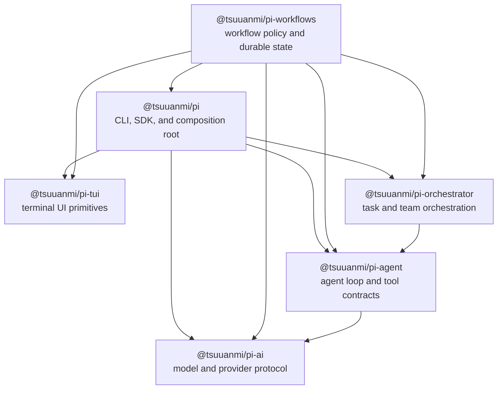

# Package Overview

Pi is a six-package TypeScript workspace. The packages separate provider transport, agent execution, task orchestration, terminal rendering, workflow policy, and the final CLI/SDK composition root.

This page is the big-picture map. Detailed component maps are linked from the [package inventory](#package-inventory). [Component Integration Map](component-integration-map.md) shows exactly how each component is imported, dynamically loaded, injected, or handed off. Import policy and enforcement are documented in [Package Boundaries](package-boundaries.md), and duplicate/ambiguous ownership is tracked in [Package Overlap Audit](package-overlap-audit.md).

## Reading the dependency graph

Arrows below point from a consumer to a direct runtime dependency. They do not represent event or callback direction.



The graph is acyclic. Two packages are workspace leaves:

- `@tsuuanmi/pi-ai` has no workspace dependency.
- `@tsuuanmi/pi-tui` has no workspace dependency.

`@tsuuanmi/pi` is the composition root. Pi does not statically import Workflows; Workflows consumes only Pi's public host/session contracts. Pi retains `@tsuuanmi/pi-orchestrator` in its runtime dependency closure because the bundled Workflows artifact uses it, but Pi does not import orchestrator APIs or workflow policy.

## Package inventory

| Package | Primary role | Direct workspace dependencies | Runtime dependents | Detail |
|---|---|---|---|---|
| `@tsuuanmi/pi-ai` | Normalized model, message, provider, OAuth, and streaming protocol | None | agent, workflows, pi | [Components and boundaries](packages/ai.md) |
| `@tsuuanmi/pi-agent` | Stateful generic agent loop, tool execution, hooks/events, receipts, and canonical Agent model/thinking types | ai | orchestrator, workflows, pi | [Components and boundaries](packages/agent.md) |
| `@tsuuanmi/pi-orchestrator` | Task DAGs, routing, concurrency, retries, verification, checkpoints, and teams | agent | workflows | [Components and boundaries](packages/orchestrator.md) |
| `@tsuuanmi/pi-tui` | Terminal I/O, differential rendering, components, input, and themes | None | workflows, pi | [Components and boundaries](packages/tui.md) |
| `@tsuuanmi/pi-workflows` | Gated workflow policy, tools, commands, state, artifacts, audit, and host adapters | ai, agent, orchestrator, tui, pi | pi | [Components and boundaries](packages/workflows.md) |
| `@tsuuanmi/pi` | CLI, SDK, settings, `.pi` roots and base session layout, loaders, extensions, tools, UI, and concrete subagents | ai, agent, orchestrator, tui | External users and dynamically loaded packages | [Components and boundaries](packages/pi.md) |

`@tsuuanmi/pi-orchestrator` also declares `@tsuuanmi/pi-ai` as a development dependency for tests; it has no direct runtime source import from AI.

## Architectural planes

### Provider protocol

`@tsuuanmi/pi-ai` is the lowest model-facing layer. It defines normalized models, request context, messages, tools, usage, streaming events, provider registration, and built-in Anthropic/OpenAI-family adapters. It represents tool calls but does not execute them.

### Agent execution

`@tsuuanmi/pi-agent` consumes the AI stream contract and owns the model/tool turn loop. It manages agent state, queueing, hooks, events, tool execution, traces, pruning, structured output, and canonical Agent model/thinking types. The root entry is host-neutral; Node-specific process and filesystem helpers are isolated in `@tsuuanmi/pi-agent/node`. Session-aware subagents are Pi-owned.

`@tsuuanmi/pi-orchestrator` runs one level above an `Agent`. It owns task graphs, agent selection, scheduling, retries, verification, budgets, receipts, and checkpoint contracts. It delegates each actual model/tool run back to `Agent.run()` and delegates durable checkpoint storage to its caller.

### Host adapters

`@tsuuanmi/pi-tui` is the terminal presentation toolkit. It knows how to read terminal input, render component trees, manage focus and overlays, and produce differential output. It does not know about models, sessions, or application commands.

### Workflow policy

`@tsuuanmi/pi-workflows` owns Deep Interview, Ralplan, Team, and Ultragoal policy. It adds session-scoped workflow state, transitions, gates, artifacts, audit records, CLI commands, model-visible tools, and Pi extension hooks. It consumes Pi's public session-aware subagent API and does not reimplement Agent or subagent execution engines.

### Application composition

`@tsuuanmi/pi` is where the layers become a product. It loads settings and package resources, chooses a model, builds an `AgentSession`, registers coding tools and providers, persists sessions, hosts extensions, implements concrete subagents, and dispatches interactive, print, JSON, or RPC modes.

## Main runtime interactions

### Standard model turn

```text
User / RPC input
  -> @tsuuanmi/pi mode and AgentSession
  -> @tsuuanmi/pi-agent Agent.prompt()
  -> @tsuuanmi/pi-ai stream(model, context, options)
  -> provider adapter / remote model
  -> normalized stream events
  -> agent tool execution and next turns
  -> Pi session persistence plus TUI, JSON, or RPC output
```

Pi owns credentials, selected model, concrete tools, extension hooks, and persistence. Agent owns turn control and tool-call execution. AI owns provider dispatch and event normalization.

### Workflow run

```text
Workflow skill or tool
  -> @tsuuanmi/pi-workflows guard and state transition
  -> workflow policy and state transition
  -> @tsuuanmi/pi-orchestrator task/team run when generic orchestration is needed
  -> injected @tsuuanmi/pi SubagentManagerApi or generic Agent
  -> Pi concrete subagent/session backend
  -> workflow receipts, artifacts, audit, and HUD state
```

Control returns through injected callbacks and interfaces. The lower packages never import Pi to call upward.

### Terminal and workflow status

```text
AgentSession and extension events
  -> Pi interactive controllers and components
  -> @tsuuanmi/pi-tui render tree
  -> differential terminal output

Workflow state under .pi/<session-id>/workflows
  -> workflow HUD summary
  -> Pi status-line data provider
  -> @tsuuanmi/pi-tui status-line component
```

## Public boundaries

- A package's `package.json` `exports` map and the public barrels referenced by it define the supported code surface. `@tsuuanmi/pi-tui` has only its root `main`/`types` entry and no subpath export map.
- `#ai/*`, `#agent/*`, `#orchestrator/*`, `#tui/*`, `#workflows/*`, and `#pi/*` are package-internal aliases, not cross-package APIs.
- Direct workspace imports must also be declared in `dependencies` or `peerDependencies`; a transitive dependency is not an API.
- Host callbacks and interfaces are preferred over upward imports. Examples are `StreamFunction`, Pi's `SubagentManagerApi`, `OrchestratorCheckpointStore`, TUI `Component`, and workflow host interfaces.
- Persistence is owned by the layer that defines the durable schema. Pi owns application settings, auth, and session records; workflows owns workflow state/artifacts; orchestrator only defines checkpoint contracts; AI and TUI do not persist application state.

## Build and distribution interactions

The logical build levels are:

1. AI and TUI can build independently.
2. Agent builds after AI.
3. Orchestrator builds after Agent.
4. Pi compiles its host/session declarations after AI, Agent, and TUI.
5. Workflows builds after Pi, AI, Agent, Orchestrator, and TUI.
6. Pi copies the compiled `pi` packages into its final distribution.

The root build explicitly runs AI, Agent, Orchestrator, TUI, Pi TypeScript compilation, Workflows, and then Pi asset copying. The final Pi asset phase bundles every compiled package declaring `pi` resources into the published CLI distribution. Build configurations consume lower-package `dist` declarations, so this ordering is explicit and must remain synchronized.

## Enforcement status

`scripts/check-package-boundaries.mjs` validates the configured AI, Agent, Orchestrator, TUI, Workflows, and Pi graph, direct dependency declarations, build aliases, exports, and selected internal seams.

## Where to make a change

| Change | Owning package |
|---|---|
| Add or normalize an LLM provider/API protocol | `@tsuuanmi/pi-ai` |
| Change the single-agent turn loop, generic tools, hooks, or Agent model/thinking contracts | `@tsuuanmi/pi-agent` |
| Change task scheduling, routing, retries, verification, or checkpoint contracts | `@tsuuanmi/pi-orchestrator` |
| Change terminal rendering, component contracts, input, or themes | `@tsuuanmi/pi-tui` |
| Change workflow phases, gates, tools, artifacts, audit, or handoff policy | `@tsuuanmi/pi-workflows` |
| Change CLI/SDK startup, sessions, settings, extensions, resource loading, concrete tools, UI composition, or session-aware subagents | `@tsuuanmi/pi` |

## Related architecture

- [Component Integration Map](component-integration-map.md)
- [Package Boundaries](package-boundaries.md)
- [Runtime Lifecycle](runtime-lifecycle.md)
- [Persistence Boundaries](persistence-boundaries.md)
- [Orchestrator vs. Workflows](orchestrator-vs-workflows.md)
- [Package and Extension Authoring](package-and-extension-authoring.md)
- [Package Overlap Audit](package-overlap-audit.md)
- [Package Overlap Implementation](package-overlap-implementation.md)
